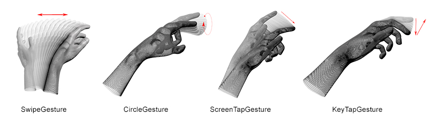

===

[](https://gitter.im/nok/leap-motion-processing?utm_source=badge&utm_medium=badge&utm_campaign=pr-badge&utm_content=badge)
[](https://raw.githubusercontent.com/nok/leap-motion-processing/master/LICENSE.txt)

Contributed library to use the [Leap Motion](https://leapmotion.com/) in [Processing](http://processing.org/).


## Table of Contents

- [About](#about)
- [Download](#download)
- [Installation](#installation)
- [Dependencies](#dependencies)
- [Tested](#tested)
- [Usage](#usage)
- [Changelog](#changelog)
- [Questions?](#questions)
- [License](#license)


## About

The Leap detects and tracks hands, fingers and finger-like tools. The device operates in an intimate proximity with high precision and tracking frame rate.

The Leap software analyzes the objects observed in the device field of view. It recognizes hands, fingers, and tools, reporting both discrete positions and motion. The Leap field of view is an inverted pyramid centered on the device. The effective range of the Leap extends from approximately 25 to 600 millimeters above the device (1 inch to 2 feet).


## Download

- [Leap Motion for Processing v2.3.1.6](download/LeapMotionForProcessing.zip?raw=true)


## Installation

Either you use the import manager of Processing (`Sketch > Import library ... > Add library ... > Filter: "Leap Motion"`).

Or you [download](download/LeapMotionForProcessing.zip?raw=true), unzip and copy the extracted *LeapMotionForProcessing* folder into the libraries folder of your Processing sketches. The reference and examples are stored in the *LeapMotionForProcessing* directory. For further help you can read the [instructions](http://www.learningprocessing.com/tutorials/libraries/) by [Daniel Shiffman](https://github.com/shiffman).


## Dependencies

- Running [Leap Motion Software](https://developer.leapmotion.com/v2) v2 (2.3.1+31549)


## Tested

System:

- **OSX** (*Mac OS 10.7 and higher*)
- **Linux** (*not tested yet, but it should work*) (*Ubuntu Linux 12.04 LTS and Ubuntu 13.04 Raring Ringtail*)
- **Windows** (*not tested yet, but x86 and x64 should work*) (*Windows 7 and 8*)

Processing version:

- 3.2.3
- 3.1.2
- 3.1.1
- 3.0.2
- 3.0.1
- 3.0a5

To use an older version of Processing examine the [release](https://github.com/nok/leap-motion-processing/releases) section:

- 2.2.1
- 2.1.2
- 2.1.1
- 2.1.0
- 2.0.1
- 2.0b9
- 2.0b8
- 2.0b7

Leap Motion Software version:

* **2.3.1+31549**
* 2.2.5+26752
* 2.2.4+26750
* 2.2.3+25971
* 2.2.1+24116
* 2.2.0+23475
* 2.1.6+23110
* 2.1.5+22699
* 2.0.5+18024 beta
* 2.0.4+17546 beta
* 2.0.3+17004 beta
* 2.0.2+16391 beta
* 2.0.1+15831 beta
* 2.0.0+13819 beta


## Usage

* [Basics](#basics)
* [Gestures](#gestures)
* [Camera-Images](#camera-images)


### Basics

The following example shows the basic [data access](reference/e1_basic.png):

```java
import de.voidplus.leapmotion.*;

// ======================================================
// Table of Contents:
// ├─ 1. Callbacks
// ├─ 2. Hand
// ├─ 3. Arms
// ├─ 4. Fingers
// ├─ 5. Bones
// ├─ 6. Tools
// └─ 7. Devices
// ======================================================


LeapMotion leap;

void setup() {
  size(800, 500);
  background(255);
  // ...

  leap = new LeapMotion(this);
}


// ======================================================
// 1. Callbacks

void leapOnInit() {
  // println("Leap Motion Init");
}
void leapOnConnect() {
  // println("Leap Motion Connect");
}
void leapOnFrame() {
  // println("Leap Motion Frame");
}
void leapOnDisconnect() {
  // println("Leap Motion Disconnect");
}
void leapOnExit() {
  // println("Leap Motion Exit");
}


void draw() {
  background(255);
  // ...

  int fps = leap.getFrameRate();
  for (Hand hand : leap.getHands ()) {


    // ==================================================
    // 2. Hand

    int     handId             = hand.getId();
    PVector handPosition       = hand.getPosition();
    PVector handStabilized     = hand.getStabilizedPosition();
    PVector handDirection      = hand.getDirection();
    PVector handDynamics       = hand.getDynamics();
    float   handRoll           = hand.getRoll();
    float   handPitch          = hand.getPitch();
    float   handYaw            = hand.getYaw();
    boolean handIsLeft         = hand.isLeft();
    boolean handIsRight        = hand.isRight();
    float   handGrab           = hand.getGrabStrength();
    float   handPinch          = hand.getPinchStrength();
    float   handTime           = hand.getTimeVisible();
    PVector spherePosition     = hand.getSpherePosition();
    float   sphereRadius       = hand.getSphereRadius();

    // --------------------------------------------------
    // Drawing
    hand.draw();


    // ==================================================
    // 3. Arm

    if (hand.hasArm()) {
      Arm     arm              = hand.getArm();
      float   armWidth         = arm.getWidth();
      PVector armWristPos      = arm.getWristPosition();
      PVector armElbowPos      = arm.getElbowPosition();
    }


    // ==================================================
    // 4. Finger

    Finger  fingerThumb        = hand.getThumb();
    // or                        hand.getFinger("thumb");
    // or                        hand.getFinger(0);

    Finger  fingerIndex        = hand.getIndexFinger();
    // or                        hand.getFinger("index");
    // or                        hand.getFinger(1);

    Finger  fingerMiddle       = hand.getMiddleFinger();
    // or                        hand.getFinger("middle");
    // or                        hand.getFinger(2);

    Finger  fingerRing         = hand.getRingFinger();
    // or                        hand.getFinger("ring");
    // or                        hand.getFinger(3);

    Finger  fingerPink         = hand.getPinkyFinger();
    // or                        hand.getFinger("pinky");
    // or                        hand.getFinger(4);        


    for (Finger finger : hand.getFingers()) {
      // or              hand.getOutstretchedFingers();
      // or              hand.getOutstretchedFingersByAngle();

      int     fingerId         = finger.getId();
      PVector fingerPosition   = finger.getPosition();
      PVector fingerStabilized = finger.getStabilizedPosition();
      PVector fingerVelocity   = finger.getVelocity();
      PVector fingerDirection  = finger.getDirection();
      float   fingerTime       = finger.getTimeVisible();

      // ------------------------------------------------
      // Drawing

      // Drawing:
      // finger.draw();  // Executes drawBones() and drawJoints()
      // finger.drawBones();
      // finger.drawJoints();

      // ------------------------------------------------
      // Selection

      switch(finger.getType()) {
      case 0:
        // System.out.println("thumb");
        break;
      case 1:
        // System.out.println("index");
        break;
      case 2:
        // System.out.println("middle");
        break;
      case 3:
        // System.out.println("ring");
        break;
      case 4:
        // System.out.println("pinky");
        break;
      }


      // ================================================
      // 5. Bones
      // --------
      // https://developer.leapmotion.com/documentation/java/devguide/Leap_Overview.html#Layer_1

      Bone    boneDistal       = finger.getDistalBone();
      // or                      finger.get("distal");
      // or                      finger.getBone(0);

      Bone    boneIntermediate = finger.getIntermediateBone();
      // or                      finger.get("intermediate");
      // or                      finger.getBone(1);

      Bone    boneProximal     = finger.getProximalBone();
      // or                      finger.get("proximal");
      // or                      finger.getBone(2);

      Bone    boneMetacarpal   = finger.getMetacarpalBone();
      // or                      finger.get("metacarpal");
      // or                      finger.getBone(3);

      // ------------------------------------------------
      // Touch emulation

      int     touchZone        = finger.getTouchZone();
      float   touchDistance    = finger.getTouchDistance();

      switch(touchZone) {
      case -1: // None
        break;
      case 0: // Hovering
        // println("Hovering (#" + fingerId + "): " + touchDistance);
        break;
      case 1: // Touching
        // println("Touching (#" + fingerId + ")");
        break;
      }
    }


    // ==================================================
    // 6. Tools

    for (Tool tool : hand.getTools()) {
      int     toolId           = tool.getId();
      PVector toolPosition     = tool.getPosition();
      PVector toolStabilized   = tool.getStabilizedPosition();
      PVector toolVelocity     = tool.getVelocity();
      PVector toolDirection    = tool.getDirection();
      float   toolTime         = tool.getTimeVisible();

      // ------------------------------------------------
      // Drawing:
      // tool.draw();

      // ------------------------------------------------
      // Touch emulation

      int     touchZone        = tool.getTouchZone();
      float   touchDistance    = tool.getTouchDistance();

      switch(touchZone) {
      case -1: // None
        break;
      case 0: // Hovering
        // println("Hovering (#" + toolId + "): " + touchDistance);
        break;
      case 1: // Touching
        // println("Touching (#" + toolId + ")");
        break;
      }
    }
  }


  // ====================================================
  // 7. Devices

  for (Device device : leap.getDevices()) {
    float deviceHorizontalViewAngle = device.getHorizontalViewAngle();
    float deviceVericalViewAngle = device.getVerticalViewAngle();
    float deviceRange = device.getRange();
  }
}
```


### Gestures



> Source: [Leap Motion](https://developer.leapmotion.com/documentation/skeletal/java/devguide/Leap_Overview.html#gestures)

The following example shows how to recognize predefined gestures:

```java
import de.voidplus.leapmotion.*;

// ======================================================
// Table of Contents:
// ├─ 1. Swipe Gesture
// ├─ 2. Circle Gesture
// ├─ 3. Screen Tap Gesture
// └─ 4. Key Tap Gesture
// ======================================================


LeapMotion leap;

void setup(){
  size(800, 500);
  background(255);
  // ...

  leap = new LeapMotion(this).allowGestures();  // All gestures
  // leap = new LeapMotion(this).allowGestures("circle, swipe, screen_tap, key_tap");
  // leap = new LeapMotion(this).allowGestures("swipe");  // Leap detects only swipe gestures
}

void draw(){
  background(255);
  // ...
}


// ======================================================
// 1. Swipe Gesture

void leapOnSwipeGesture(SwipeGesture g, int state){
  int     id               = g.getId();
  Finger  finger           = g.getFinger();
  PVector position         = g.getPosition();
  PVector positionStart    = g.getStartPosition();
  PVector direction        = g.getDirection();
  float   speed            = g.getSpeed();
  long    duration         = g.getDuration();
  float   durationSeconds  = g.getDurationInSeconds();

  switch(state){
    case 1: // Start
      break;
    case 2: // Update
      break;
    case 3: // Stop
      println("SwipeGesture: " + id);
      break;
  }
}


// ======================================================
// 2. Circle Gesture

void leapOnCircleGesture(CircleGesture g, int state){
  int     id               = g.getId();
  Finger  finger           = g.getFinger();
  PVector positionCenter   = g.getCenter();
  float   radius           = g.getRadius();
  float   progress         = g.getProgress();
  long    duration         = g.getDuration();
  float   durationSeconds  = g.getDurationInSeconds();
  int     direction        = g.getDirection();

  switch(state){
    case 1: // Start
      break;
    case 2: // Update
      break;
    case 3: // Stop
      println("CircleGesture: " + id);
      break;
  }

  switch(direction){
    case 0: // Anticlockwise/Left gesture
      break;
    case 1: // Clockwise/Right gesture
      break;
  }
}


// ======================================================
// 3. Screen Tap Gesture

void leapOnScreenTapGesture(ScreenTapGesture g){
  int     id               = g.getId();
  Finger  finger           = g.getFinger();
  PVector position         = g.getPosition();
  PVector direction        = g.getDirection();
  long    duration         = g.getDuration();
  float   durationSeconds  = g.getDurationInSeconds();

  println("ScreenTapGesture: " + id);
}


// ======================================================
// 4. Key Tap Gesture

void leapOnKeyTapGesture(KeyTapGesture g){
  int     id               = g.getId();
  Finger  finger           = g.getFinger();
  PVector position         = g.getPosition();
  PVector direction        = g.getDirection();
  long    duration         = g.getDuration();
  float   durationSeconds  = g.getDurationInSeconds();

  println("KeyTapGesture: " + id);
}

```

### Camera-Images

Furthermore you have access to the [raw camera images](reference/e3_camera_images.png):

```java
import de.voidplus.leapmotion.*;


LeapMotion leap;

void setup(){
	size(640, 480);
	background(255);  
	leap = new LeapMotion(this);
}

void draw(){
	background(255);

	if (leap.hasImages()) {
		for (Image camera : leap.getImages()) {
			if (camera.isLeft()) {
				// left camera
				image(camera, 0, 0);
			} else {
				// right camera
				image(camera, 0, camera.getHeight());
			}
		}
	}

}
```


## Changelog

You can find the changes in the [release](https://github.com/nok/leap-motion-processing/releases) section.


## Questions?

Don't be shy and feel free to contact me on [Twitter](https://twitter.com/darius_morawiec) or [Gitter](https://gitter.im/nok/leap-motion-processing).


## License

The library is Open Source Software released under the [license](LICENSE.txt).
